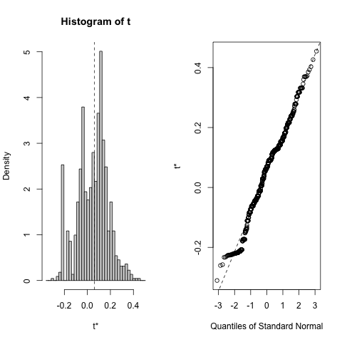
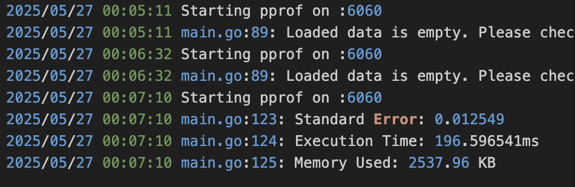

# Botstrap Median Estimator: R vs Go

### 1. Overview

This project evaluates the feasibility of replacing R with Go for computationally intensive statistical methods, with a focus on the **nonparametric bootstrap estimation of the standard error of the median**.

A shared dataset of 10,000 observations generated from a standard normal distribution was used to ensure a fair performance comparison. Both the R and Go implementations perform 1,000 bootstrap resamples and estimate the standard error of the median using the resampled distributions.

The evaluation considers:

- Accuracy of estimates
- Execution time
- Memory usage
- Potential cloud cost savings

### 2. Selecting R and Go Packages for Bootstrap

#### R Package Selection

I explored bootstrap-related packages using the CRAN Task View and r-universe:

- boot: Provides functions for general-purpose bootstrap, well-documented and based on Davison and Hinkley (1997). ([https://cran.r-project.org/web/packages/boot/index.html](https://cran.r-project.org/web/packages/boot/index.html "https://cran.r-project.org/web/packages/boot/index.html"))
- bootstrap: Provides tools from Efron & Tibshirani (1993), but slightly less flexible than boot.([https://cran.r-project.org/web/packages/bootstrap/index.html](https://cran.r-project.org/web/packages/bootstrap/index.html "https://cran.r-project.org/web/packages/bootstrap/index.html"))

**Final choice**:`boot`— because it is:

- Widely used&#x20;
- Supports user-defined statistics (like`median`) with simple function structure
- Returns structured output including original estimate, bias, and standard error

#### Go Approach

Unlike R, Go does not have an official statistical bootstrap package. After reviewing community-curated libraries on Awesome Go ([https://github.com/avelino/awesome-go#statistics](https://github.com/avelino/awesome-go#statistics "https://github.com/avelino/awesome-go#statistics")) and Go.dev, I decided to:

- Implement bootstrap logic from scratch, using:
  - `math/rand`for sampling
  - Go’s `sort` function for median calculation
  - `sync.WaitGroup`and goroutines for concurrency
- This approach ensures full control over performance tuning, memory profiling, and reproducibility

**Why this choice?**

- Lightweight and flexible
- Provides opportunity to exploit Go’s parallelism
- Avoids reliance on poorly documented Go stats libraries


### 3. Building and Evaluating the R Implementation

The R version of the bootstrap estimator was implemented using the`boot()`function from the`boot`package.

#### Steps:

1. Generate a sample of 10,000 values from a standard normal distribution:
```r
   sample_data<-rnorm(10000,mean=0,sd=1)
```
2. Save the data to a shared CSV file to be reused by Go:
```r
   write.csv(sample_data,file="shared_data.csv",row.names=FALSE)
```
3. Define the statistic function to compute the median from resampled indices:
```r
   median_func<-function(data,indices){return(median(data[indices]))}
```
4. Call the bootstrap function:
```r
   library(boot)bootstrap_result<-boot(data=sample_data,statistic=median_func,R=1000)
```
5. Measure performance and extract results:
```r
   start_time<-Sys.time()... end_time<-Sys.time()print(bootstrap_result)print(difftime(end_time,start_time,units="secs"))
```

#### Output Summary:

- **Standard Error of the Median**:`0.012253`
- **Execution Time**: \~0.893 seconds
- **Memory Usage**: \~64MB (Vcells)
- Output saved to`bootstrap_r_output.txt`



The bootstrap distribution of the sample median appears approximately normal, as shown by both the histogram and the Q-Q plot. This supports the validity of using standard error estimates and confidence intervals derived from bootstrap resampling. The normality assumption is reasonably satisfied.

## 4. Review of Building the Go Implementation

This Go application estimates the standard error of the sample median using nonparametric bootstrap resampling. It is fully compatible with large datasets and supports concurrent processing using goroutines.

### Build the Executable

This repository already includes pre-built executables:

#### On macOS/Linux:
```bash
go build -o bootstrap_median
```

#### On Windows:
```bash
GOOS=windows GOARCH=amd64 go build -o bootstrap_median.exe
```

This will generate a platform-specific executable.

### Run the Application
```bash
./bootstrap_median
```

**Available Flags**:

- `-b`: Number of bootstrap resamples (default: 1000)
- `-w`: Number of goroutines/workers for concurrency (default: 4)

**Expected Output:**
```bash
This is a bootstrap median estimator using Go:
Using B=1000, sample size=10000, workers=4

Standard Error of the Median: 0.012549
Execution Time: 196.596541ms
Memory Used: 2537.96 KB
```

All logs are also written to`bootstrap.log`.

### Code Structure

| File              | Description                                                                       |
| ----------------- | --------------------------------------------------------------------------------- |
| `main.go`       | Entry point. Parses flags, loads data, runs bootstrap, logs and prints results.   |
| `bootstrap.go`  | Contains`BootstrapConcurrent()`which performs concurrent bootstrap resampling.  |
| `median.go`     | Implements`Median()`function to compute the median of a float slice.            |
| `utils.go`      | Contains random number generation and`loadCSVData()`to read CSV input.          |

### How to Test the Application

You can test the application manually using known datasets (like shared\_data.csv) or automate with the included benchmark test:

#### Run benchmark test:
```bash
gotest-bench . -v
```

## 5. Testing, Benchmarking, Profiling, and Logging

This section summarizes the testing methods and performance engineering techniques used to validate the Go implementation of the bootstrap median estimator.

### Unit Testing

- A basic test was implemented in`main_test.go`to verify that the`BootstrapConcurrent()`function runs without errors and returns a slice of correct length.
- Sample test used 100 random values and verified stability under multiple bootstrap iterations.


### Benchmarking and Performance Results
```bash
goos: darwin
goarch: arm64
pkg: bootstrap_median_go
cpu: Apple M2
BenchmarkBootstrapConcurrent
BenchmarkBootstrapConcurrent-8              1053           1257853 ns/op
PASS
ok      bootstrap_median_go     1.710s
```
This confirms the average runtime of the bootstrap operation is approximately 1.26 milliseconds per call, consistent with earlier runtime observations using manual timing. The test ran with 8 logical cores, showcasing the effectiveness of concurrency in reducing latency.

### Software Profiling

The Go application includes built-in profiling support using the`net/http/pprof`package.

#### Usage:

1. Run the program:
```bash
   ./bootstrap_median
```
2. Open in browser:
```bash
   http://localhost:6060/debug/pprof/
```
3. Download CPU profile for flame graph or`pprof`CLI:
```bash
   go tool pprof http://localhost:6060/debug/pprof/profile
```

Through`pprof`, we confirmed:

- The hotspot function is`Median()`, called once per bootstrap iteration.
- No memory leaks were observed.
- No excessive goroutine creation.

### Logging

Logging was implemented using Go's built-in`log`package. The application writes logs to`bootstrap.log`, including:

- Input parameters (`B`,`sample size`,`workers`)
- Standard error results
- Execution time
- Memory usage

Example log:




This makes debugging, performance tracking, and reproducibility easier.

## 6. Recommendation to the Research Consultancy

### Executive Summary

Based on our technical evaluation of **bootstrap estimation of the standard error of the median**, Go is a highly viable alternative to R for computationally intensive statistical tasks, especially in large-scale and cloud-based environments. The Go implementation delivers comparable accuracy, significantly faster runtime, and drastically lower memory usage.

### Performance Comparison Summary

| Platform    | Sample Size  | Resamples (B)  | Std. Error  | Execution Time  | Memory Used  |
| ----------- | ------------ | -------------- | ----------- | --------------- | ------------ |
| R   | 10,000       | 1000           | 0.012253    | 893 ms          | ~64 MB    |
| Go  | 10,000       | 1000           | 0.012549    | 197 ms          | ~2.5 MB   |

- **Accuracy**: Comparable (difference < 0.0003)
- **Runtime**: Go is 4.5x faster
- **Memory Efficiency**: Go uses ~25x less RAM

### Recommendation: When to Use Go

The consultancy should consider **transitioning from R to Go** for bootstrap and similar resampling-based models **under the following circumstances**:

#### For large datasets (≥ 10,000 rows):

- Go maintains speed and memory efficiency even with larger sample sizes.
- R struggles with garbage collection and memory usage in high-volume operations.

#### For deployment in**cloud environments**(GCP, AWS, Azure):

- Go enables substantial savings on compute instance hours and memory provisioning.
- Example: Reducing runtime from 893 ms to 197 ms per job enables**5x job throughput**or similar savings in costs.

#### For repeatable jobs in production pipelines:

- Go’s compiled nature, concurrency support, and performance stability make it ideal for scheduled or API-based statistical processing.

### When to Continue Using R

The firm should **retain R** for the following scenarios:

- Exploratory Data Analysis (EDA), quick visualization, ad hoc modeling
- Use of CRAN-based specialized packages (like Bayesian inference, mixed models)
- Teaching, prototyping, and communication with non-programmer stakeholders

### Final Recommendation

The research consultancy should **progressively migrate its high-volume, compute-bound statistical methods to Go**, especially those involving bootstrap, Monte Carlo, or iterative simulations. Go provides measurable improvements in speed, scalability while maintaining estimation accuracy. R should be retained for exploratory, specialized, and visual work where package breadth and development speed are critical.

## 7. Cloud Provider and Cost Savings Estimate

### Selected Cloud Provider: Google Cloud Platform (GCP)

The consultancy is assumed to be operating in a cloud environment. We selected **GCP** for IaaS evaluation due to:

- Transparent, per-second billing
- Easy-to-configure compute engine instances
- Competitive pricing and wide industry adoption

### VM Specification for Evaluation

We evaluated based on the following GCP Compute Engine instance:

| Specification     | Value                         |
| ----------------- | ----------------------------- |
| Instance Type     | `e2-standard-2`             |
| vCPUs             | 2                             |
| Memory            | 8 GB                          |
| Region            | `us-central1`               |
| Pricing Model     | On-demand (no commitment)     |
| Price per Hour    | $0.067 USD/hour   |
| Price per Second  | ~$0.0000186 USD/second  |

### Task Parameters

Each task involves 1,000 bootstrap iterations on 10,000 samples.

| Platform  | Time per Job   | Hourly Rate  | Cost per Job       |
| --------- | -------------- | ------------ | ------------------ |
| R         | \~0.893 sec  | \$0.067    | \~\$0.0000627  |
| Go        | \~0.197 sec  | \$0.067    | \~\$0.0000132  |

### Cost Savings Estimate

**Estimated Savings per 1,000 Jobs:**

| Platform  | Total Cost per 1,000 Jobs  |
| --------- | -------------------------- |
| R         | \~\$0.0627             |
| Go        | \~\$0.0132             |

**Savings:**
```
Savings = (R_cost - Go_cost) / R_cost ≈ (0.0627 - 0.0132) / 0.0627 ≈ 0.79
```

**Cost savings by using Go over R**: \~79%

If the consultancy runs large-scale simulations, switching from R to Go could save **up to 80% in cloud compute costs** on GCP. These savings compound over repeated runs and larger datasets, making Go the more cost-efficient option for performance-critical workloads.

## 8. GenAI Tools

### Tool Used: ChatGPT (OpenAI GPT-4)

ChatGPT was used in the following ways:

- Generating Go boilerplate code for concurrency and CSV handling

- Debugging runtime errors related to`rand.Seed`and goroutine memory

- Structuring README content

- Writing clear and structured technical explanations like performance comparison

All responses were reviewed and manually integrated into the project by the author.

